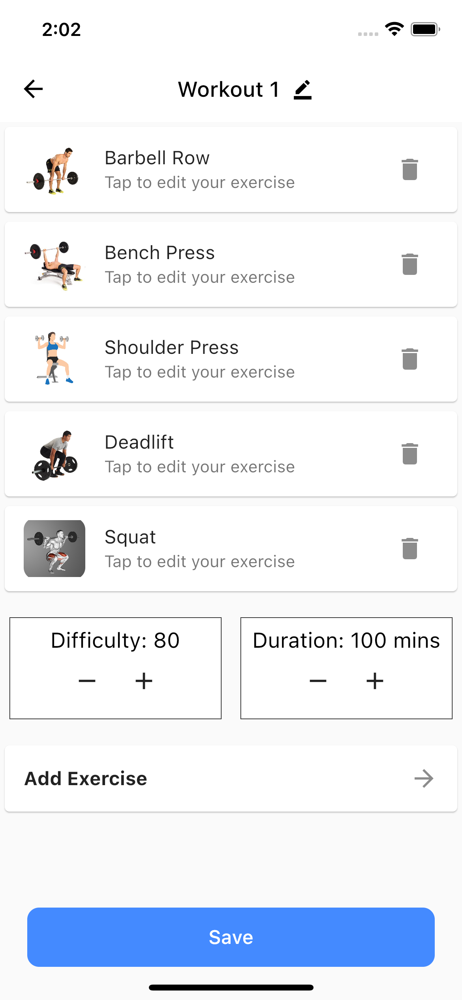

# Workout App

Workout application developed with Flutter

## Table of contents

- [Overview](#overview)
  - [Screenshot](#screenshot)
  - [Built with](#built-with)
- [Introduction](#introduction)
  - [Screens (UI)](#ui-screens)
  - [Widgets (UI)](#ui-widgets)
  - [Logic](#logic)
  - [Data](#data)
  - [Packages](#packages)
- [Author](#author)

## Overview

### Screenshot

### Built with

Languages:

- Dart
- Flutter

Concepts:

- UI: Slivers
- Logic: Bloc Design Patter, Hydrated Storage
- Data: Fake APIs and modelling

## Introduction

An app that displays the user workouts.

Features include:

- User workouts are displayed in Workout List Page
- For every workout, there is Workout Page with details
- User can edit the details such as exercises and update the workout
- For every exercise there is an Exercise Page with details
- User can edit the exercise and update it
- Update is optional, there is an option to leave without save
- All data is persistent and stored with Hydrated Bloc

### Screens (UI)

There is 5 pages in total:

Workout List Page: Page that displays the workout list  
Workout Page: Page that displays the exercises and the workout details  
Exercise Page: Page that displays exercise details  
Welcome Page: The very first page with bottom navigation bar  
Empty Page: Just a page for other bottom navbar pages

### Widgets (UI)

Below you can see the list of widgets.

Custom Progress Indicator: The progress indicator to display the loading state  
Workout Card: The ListTile widget for the workouts  
Exercise Card: The ListTile widget for the exercises  
Exercise Image: The image widget that display the corresponding exercise type  
Sets Card: The ListTile widget that displays the sets

### Logic

BLoc design pattern and state managemenet library used for logic.

Workout Bloc: Workouts is accessed and updated through this bloc.

Hydrated Bloc: The workout state of the application is stored and updated on relaunch

### Data

Data is composed of 3 parts: Models, Providers and Repositories

- Data Models:

Workout Model: Workout model is implemented here

- Data Providers:

Workout Provider: This is the data layer consist of APIs

- Data Repositories:

Workout Repository: Turns API result into Workout object and returns to bloc layer

### Packages

Below you can see the packages used.

flutter_bloc: Bloc  
 equatable: Object equality  
 hydrated_bloc: Bloc state storage  
 path_provider: Storage  
 json_annotation: JSON  
 shared_preferences: Storage  
 flutter_cache_manager: Caching

dev_dependencies:  
build_runner: JSON  
 json_serializable: JSON  
 mocktail: Testing  
 bloc_test: Bloc testing  
 integration_test: Integration testing

## Author

Erke Canbazoğlu

- Linkedin - [Erke Canbazoğlu](https://www.linkedin.com/in/erkecanbazoglu/)
- Github - [erkecanbazoglu](https://github.com/erkecanbazoglu)
